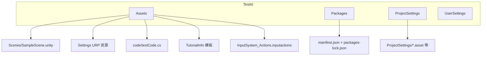

# GameDemo 工作区结构说明

## 顶层布局

| 路径 | 说明 |
|------|------|
| `.cursor/settings.json` | Cursor 插件开关：`superpowers`、`continual-learning`、`sourcegraph` 均为 `enabled: true` |
| `.git` | Git 仓库元数据 |
| `TestAI/` | Unity 工程根目录（见下文） |

根目录下除本说明外，通常无其它独立文件（无根目录 sln；Unity 解决方案在 `TestAI/` 下）。

---

## Unity 工程 `TestAI/`

- **版本**：`ProjectSettings/ProjectVersion.txt` 记录 `6000.3.6f1`（Unity 6）。
- **解决方案**：`TestAI.slnx` 及大量 `*.csproj`（Unity 为各包生成的工程文件，如 `Assembly-CSharp.csproj`、`Unity.*.csproj` 等）。

### 应纳入版本控制的目录（源码与配置）

- **`TestAI/Assets/`**（当前约 36 个条目，含 `.meta`）
  - `Scenes/SampleScene.unity`：示例场景
  - `Settings/`：`Mobile_RPAsset`、`PC_RPAsset`、`Mobile_Renderer`、`PC_Renderer`、`DefaultVolumeProfile`、`SampleSceneProfile`、`UniversalRenderPipelineGlobalSettings` 等 URP 相关资源
  - `code/testCode.cs`：当前主要自定义脚本（空 `Start`/`Update`）
  - `TutorialInfo/`：含 `Readme.cs`、`ReadmeEditor.cs`、`Layout.wlt`、`Icons/URP.png` 等教程模板
  - `InputSystem_Actions.inputactions`：新输入系统资源
  - `Readme.asset`：项目说明资源

- **`TestAI/Packages/`**
  - `manifest.json`：核心依赖含 URP `17.3.0`、`com.unity.inputsystem` `1.18.0`、AI Navigation、Visual Scripting、Timeline、Test Framework、IDE 支持（Rider/VS）等；其余为 `com.unity.modules.*` 模块列表。
  - `packages-lock.json`：锁定解析结果。

- **`TestAI/ProjectSettings/`**
  - 共 **26** 个文件：常规 `ProjectSettings.asset`、`EditorSettings`、`GraphicsSettings`、`QualitySettings`、`URPProjectSettings`、`InputManager`、`TagManager`、`AudioManager`、`NavMeshAreas`、`EditorBuildSettings`、`UnityConnectSettings`、`PackageManagerSettings`、`VersionControlSettings`、`MemorySettings` 等；另有 `Packages/com.unity.dedicated-server/MultiplayerRolesSettings.asset`、`SceneTemplateSettings.json`、`ProjectVersion.txt`。

- **`TestAI/UserSettings/`**
  - `EditorUserSettings.asset`、`PlayModeUserSettings.asset`、`Search.settings`、`Search.index`、`Layouts/default-6000.dwlt` 等本地编辑器偏好（通常个人化、常进 `.gitignore`）。

### 自动生成 / 体量极大的目录（不宜逐文件列举）

- **`TestAI/Library/`**：导入缓存、Shader 编译、Burst、Bee 构建图、Search 数据库等；文件数量可达上万且持续增长。
- **`TestAI/Logs/`**：如 `AssetImportWorker*.log`、`shadercompiler-*.log`。
- **`TestAI/Temp/`**：编辑器临时目录；若不存在表示当前未生成或未检出。

---

## 自定义脚本入口

主要脚本路径：`TestAI/Assets/code/testCode.cs`（`MonoBehaviour`，空 `Start`/`Update`）。

---

## 小结

- **人写代码的主要位置**：`TestAI/Assets/code/`；场景在 `TestAI/Assets/Scenes/`；渲染管线配置在 `TestAI/Assets/Settings/`。
- **依赖与 Unity 版本**：以 `TestAI/Packages/manifest.json` 与 `TestAI/ProjectSettings/ProjectVersion.txt` 为准。
- **「所有文件」**：物理上包含海量 `Library` 生成物；讨论「项目结构」时通常以 `Assets`、`Packages`、`ProjectSettings`（及可选 `UserSettings`）为主。
